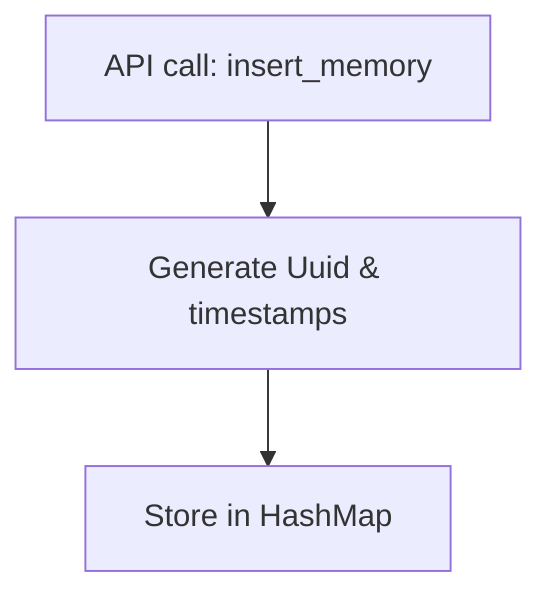
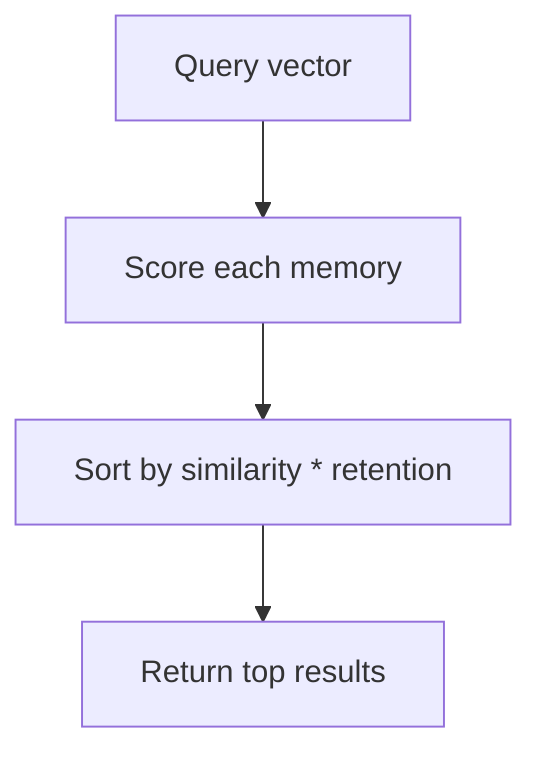
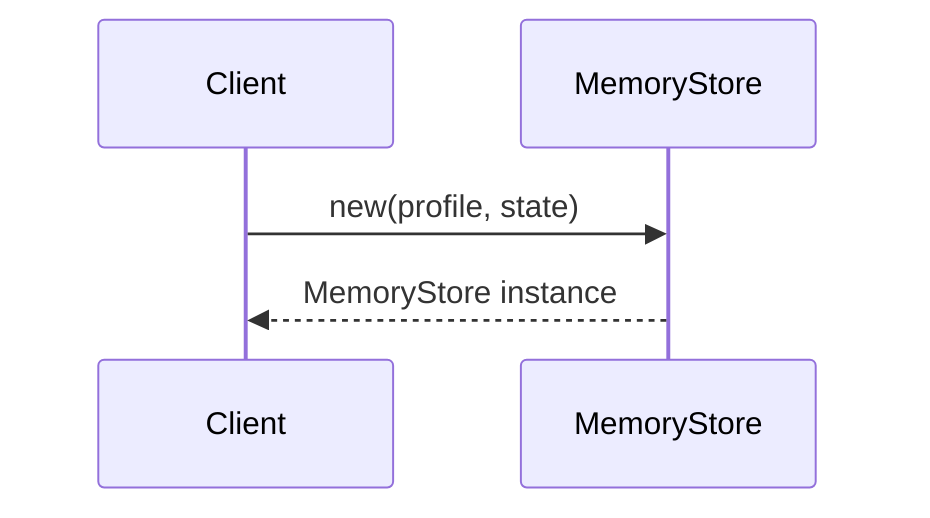
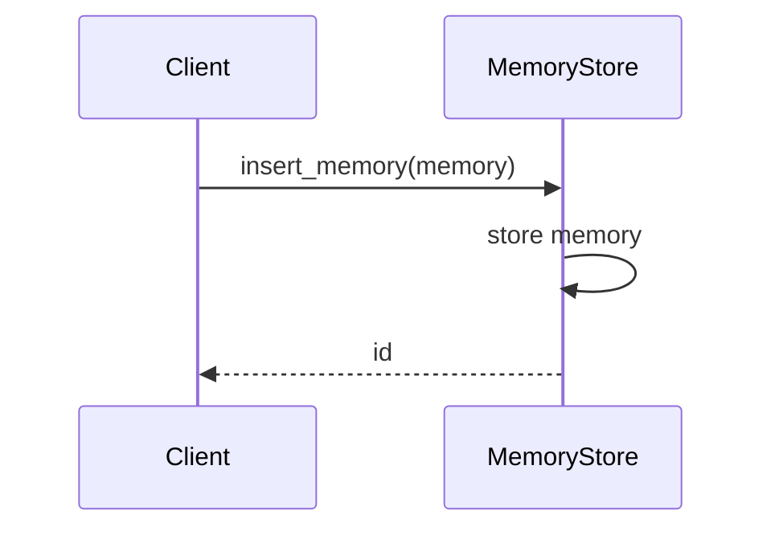
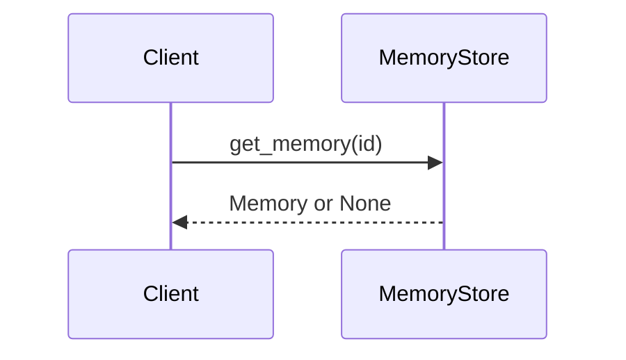
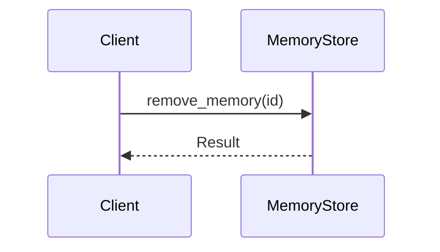
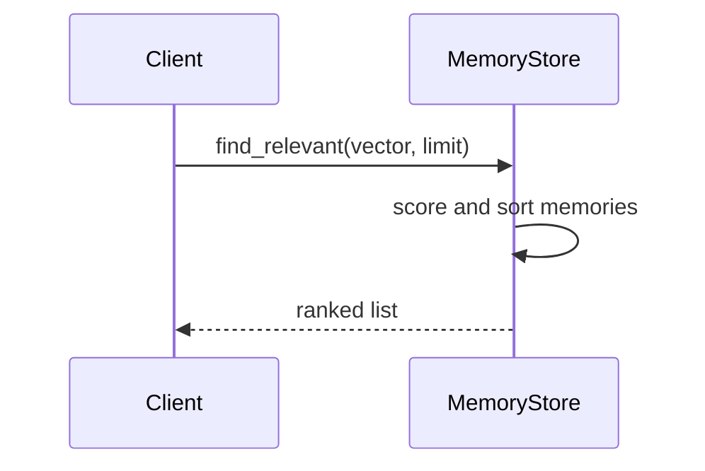
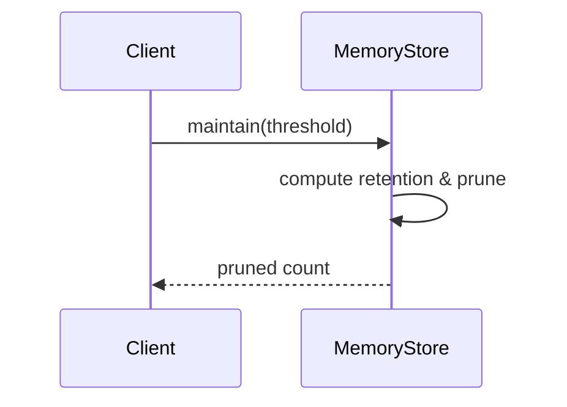

# Memory Module Architecture

This document provides a high level overview of the main components in the
`memory-module` crate and how they interact with each other. The goal is to help
new contributors quickly understand the core design.

## Goals and Non‑Goals

**Goals**

- Provide a simple in‑memory representation of an agent's experiences.
- Allow fast similarity search and biologically‑inspired retention behaviour.
- Be easy to embed in games or simulations without additional services.

**Non‑Goals**

- Long term persistence (a future persistence layer will cover this).
- Distributed storage or horizontal scalability.
- Perfect biological accuracy – the model trades precision for clarity.

## Components

### AgentProfile
Configuration parameters that define how an agent forms and retains memories.
Fields such as `decay_rate`, `emotional_bias` and `capacity_factor` determine
how quickly memories fade and how emotions influence retention.

### AgentState
Represents the agent's current cognitive and physical state. Values like
`stress`, `fatigue` and `focus` influence the retention algorithm at runtime.

### Memory
The fundamental unit stored in the system. Each `Memory` contains a semantic
vector, emotional valence and metadata such as timestamps and recall history.
It exposes methods to calculate the current retention strength and to record
retrieval events.

### MemoryStore
The central structure that manages all memories. Internally it holds a `HashMap`
of memories indexed by `Uuid`. The store provides operations to add, query and
remove memories. Retrieval uses cosine similarity combined with each memory's
retention score to rank results. Maintenance operations prune memories whose
retention falls below a configurable threshold.

### Key Terms

- **Relevance** – how closely a memory's semantic vector matches a query.
- **Retention** – the current strength of a memory after decay and retrievals.
- **Similarity** – cosine similarity between vectors used during search.

### Memory Lifecycle

1. **Creation** – a `Memory` is instantiated and assigned a `Uuid`.
2. **Storage** – it is inserted into the `MemoryStore` for later retrieval.
3. **Retrieval** – queries rank memories by `similarity * retention`; top
   results have their retrieval history updated.
4. **Eviction** – during `maintain`, memories with retention below a threshold
   are removed from the store.

## Data Flow
1. **Insertion** – A `Memory` is created and added to `MemoryStore` via
   `add_memory`. The store assigns it an identifier and stores it for later
   retrieval.
2. **Querying** – `find_relevant` computes relevance scores for each memory using
   cosine similarity and the current retention strength. Top results are
   returned and their retrieval history is updated.
3. **Maintenance** – `maintain` periodically evaluates all memories and removes
   those whose retention strength is below the provided threshold.

The `AgentProfile` and `AgentState` influence the retention calculations during
both querying and maintenance, allowing the store to simulate realistic memory
behaviour.

### Data Flow Diagrams





```mermaid
flowchart TD
    M[maintain()] --> N[Compute retention]
    N --> O{retention >= threshold?}
    O -- No --> P[Remove memory]
    O -- Yes --> Q[Keep memory]
```

## Memory Retention Algorithm

The `maintain` function removes memories whose **retention** score falls below a
configurable `retention_threshold`. Retention is calculated in
`Memory::calculate_retention` and combines several factors:

```text
phase    = 1 / (1 + exp(profile.capacity_factor * (age_at_formation - profile.capacity_factor)))
decay    = (1 + beta * age_in_days)^(-alpha)
emo_bias = 1 + profile.emotional_bias * emotion
retention = phase * decay * emo_bias * memory_strength
```

- `alpha` and `beta` come from [`DecayParams`].
- Emotional memories receive a boost through `emo_bias`.
- Repeated retrievals reduce `memory_strength` which models interference.

When `maintain` is called, each memory's retention is computed at the current
time and compared to `retention_threshold`. Memories below the threshold are
evicted.

### Trade-offs

- **Simplicity:** the algorithm is easy to understand and runs in linear time.
- **Accuracy:** it does not model sophisticated interference or context, so
  relevance estimates can be coarse.
- **Performance:** for large stores the linear scan may become expensive.

Possible alternatives include logarithmic decay functions or advanced ANN based
interference models. The current approach was chosen to keep the initial design
straightforward.

### Example

If the threshold is `0.5` and a memory's retention evaluates to `0.3`, that
memory will be removed during maintenance.

### Sequence Diagrams













## Decision Log
- _2024-05-13_: Chose simple HashMap-based store for initial implementation to optimize for clarity over performance.
